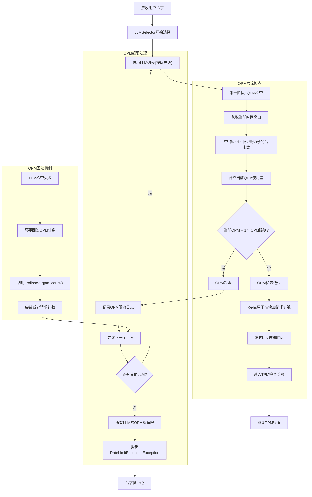
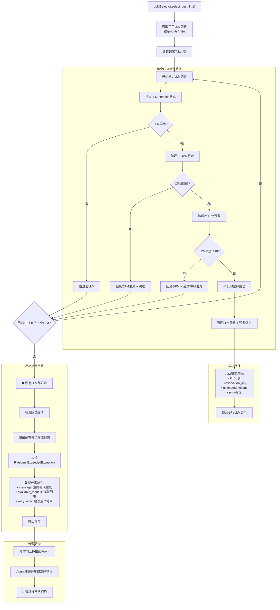
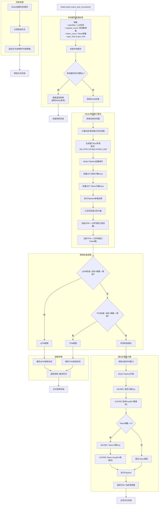
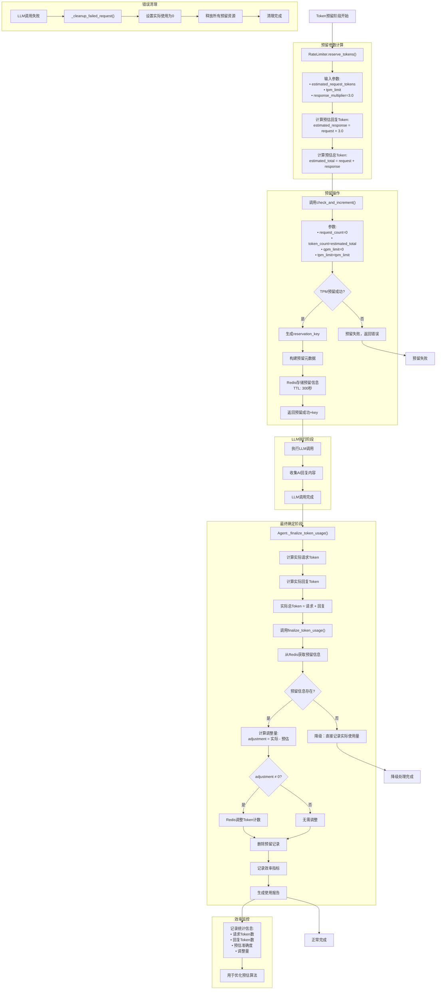
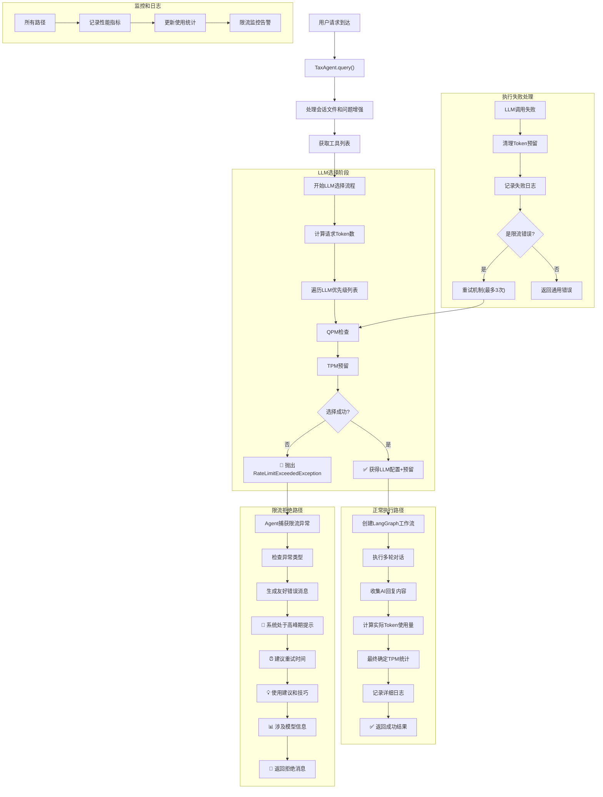

## QPM控制流程

```mermaid
graph TD
    A["接收用户请求"] --> B["LLMSelector开始选择"]
    B --> C["遍历LLM列表(按优先级)"]
    C --> D["第一阶段: QPM检查"]
    
    subgraph "QPM限流检查"
        D --> E["获取当前时间窗口"]
        E --> F["查询Redis中过去60秒的请求数"]
        F --> G["计算当前QPM使用量"]
        G --> H{当前QPM + 1 > QPM限制?}
        H -->|是| I["QPM超限"]
        H -->|否| J["QPM检查通过"]
        J --> K["Redis原子性增加请求计数"]
        K --> L["设置Key过期时间"]
        L --> M["进入TPM检查阶段"]
    end
    
    subgraph "QPM超限处理"
        I --> N["记录QPM限流日志"]
        N --> O["尝试下一个LLM"]
        O --> P{还有其他LLM?}
        P -->|是| C
        P -->|否| Q["所有LLM的QPM都超限"]
        Q --> R["抛出RateLimitExceededException"]
    end
    
    subgraph "QPM回滚机制"
        S["TPM检查失败"] --> T["需要回滚QPM计数"]
        T --> U["调用_rollback_qpm_count()"]
        U --> V["尝试减少请求计数"]
        V --> O
    end
    
    M --> W["继续TPM检查"]
    R --> X["请求被拒绝"]
```

## TPM控制流程

```mermaid
graph TD
    A["QPM检查通过"] --> B["进入TPM双阶段控制"]
    
    subgraph "阶段1: Token预留"
        B --> C["计算请求Token数"]
        C --> D["预估回复Token = 请求Token × 3"]
        D --> E["预估总Token = 请求 + 预估回复"]
        E --> F["检查Redis滑动窗口TPM使用量"]
        F --> G{当前TPM + 预估总Token > TPM限制?}
        G -->|是| H["TPM预留失败"]
        G -->|否| I["Redis原子性增加预估Token"]
        I --> J["生成reservation_key"]
        J --> K["存储预留元数据到Redis"]
        K --> L["返回预留成功 + reservation_key"]
    end
    
    subgraph "阶段2: 执行与确定"
        L --> M["执行LLM调用"]
        M --> N["收集所有AI回复内容"]
        N --> O["计算实际请求Token数"]
        O --> P["计算实际回复Token数"]
        P --> Q["实际总Token = 请求 + 回复"]
        Q --> R["获取预留信息by reservation_key"]
        R --> S["计算调整量 = 实际 - 预估"]
        S --> T{调整量 ≠ 0?}
        T -->|是| U["Redis原子性调整Token计数"]
        T -->|否| V["无需调整"]
        U --> W["删除预留记录"]
        V --> W
        W --> X["记录详细使用统计"]
        X --> Y["TPM统计完成"]
    end
    
    subgraph "TPM失败处理"
        H --> Z["记录TPM限流日志"]
        Z --> AA["回滚QPM计数"]
        AA --> BB["尝试下一个LLM"]
    end
    
    subgraph "错误清理"
        CC["LLM调用失败"] --> DD["清理Token预留"]
        DD --> EE["设置实际使用为0"]
        EE --> FF["释放预留资源"]
    end
```

## LLM选择与降级策略流程

```mermaid
graph TD
    A["LLMSelector.select_best_llm()"] --> B["获取可用LLM列表<br/>(按priority排序)"]
    B --> C["计算请求Token数"]
    C --> D["开始遍历LLM列表"]
    
    subgraph "单个LLM检查循环"
        D --> E["检查LLM.enabled状态"]
        E --> F{LLM启用?}
        F -->|否| G["跳过此LLM"]
        F -->|是| H["阶段1: QPM检查"]
        H --> I{QPM通过?}
        I -->|否| J["记录QPM限流 + 跳过"]
        I -->|是| K["阶段2: TPM预留"]
        K --> L{TPM预留成功?}
        L -->|否| M["回滚QPM + 记录TPM限流"]
        L -->|是| N["✅ LLM选择成功"]
        N --> O["返回LLM配置 + 预留信息"]
    end
    
    G --> P{列表中还有下一个LLM?}
    J --> P
    M --> P
    P -->|是| D
    P -->|否| Q["❌ 所有LLM都限流"]
    
    subgraph "严格拒绝策略"
        Q --> R["收集限流详情"]
        R --> S["记录所有模型限流状态"]
        S --> T["构造RateLimitExceededException"]
        T --> U["设置异常属性:<br/>• message: 友好错误信息<br/>• available_models: 模型列表<br/>• retry_after: 建议重试时间"]
        U --> V["抛出异常"]
    end
    
    subgraph "成功路径"
        O --> W["LLM配置包含:<br/>• llm实例<br/>• reservation_key<br/>• estimated_tokens<br/>• priority等"]
        W --> X["继续执行LLM调用"]
    end
    
    subgraph "失败路径"
        V --> Y["异常向上传播到Agent"]
        Y --> Z["Agent捕获并生成友好错误"]
        Z --> AA["🚫 请求被严格拒绝"]
    end
```

## 分布式限流算法流程

```mermaid
graph TD
    A["RateLimiter.check_and_increment()"] --> B["参数:<br/>• identifier: LLM名称<br/>• request_count: 请求数增量<br/>• token_count: Token增量<br/>• qpm_limit & tpm_limit"]
    
    subgraph "本地缓存快速检查"
        B --> C["检查本地缓存"]
        C --> D{本地缓存显示被阻止?}
        D -->|是| E["直接返回拒绝<br/>(避免Redis查询)"]
        D -->|否| F["继续Redis检查"]
    end
    
    subgraph "Redis滑动窗口算法"
        F --> G["获取当前时间戳"]
        G --> H["计算60秒滑动窗口时间范围"]
        H --> I["生成窗口Key列表<br/>格式: rate_limit:LLM:type:window_start"]
        I --> J["Redis Pipeline批量操作"]
        J --> K["批量GET请求计数Keys"]
        K --> L["批量GET Token计数Keys"]
        L --> M["执行Pipeline获取结果"]
        M --> N["汇总所有窗口的计数"]
        N --> O["当前QPM = Σ(所有窗口请求数)"]
        O --> P["当前TPM = Σ(所有窗口Token数)"]
    end
    
    subgraph "限制检查逻辑"
        P --> Q{QPM检查: 当前+增量 > 限制?}
        Q -->|是| R["QPM超限"]
        Q -->|否| S{TPM检查: 当前+增量 > 限制?}
        S -->|是| T["TPM超限"]
        S -->|否| U["所有检查通过"]
    end
    
    subgraph "超限处理"
        R --> V["缓存QPM拒绝状态"]
        T --> W["缓存TPM拒绝状态"]
        V --> X["返回拒绝+重试时间"]
        W --> X
    end
    
    subgraph "通过后更新计数"
        U --> Y["获取当前时间窗口"]
        Y --> Z["Redis Pipeline开始"]
        Z --> AA["INCRBY 请求计数Key"]
        AA --> BB["EXPIRE 请求Key(60+精度秒)"]
        BB --> CC{Token增量 > 0?}
        CC -->|是| DD["INCRBY Token计数Key"]
        CC -->|否| EE["跳过Token更新"]
        DD --> FF["EXPIRE Token Key(60+精度秒)"]
        EE --> GG["执行Pipeline"]
        FF --> GG
        GG --> HH["返回允许+当前使用量"]
    end
    
    subgraph "异常处理"
        II["Redis连接失败/超时"] --> JJ["记录错误日志"]
        JJ --> KK["返回允许(故障时开放策略)"]
    end
    
    E --> LL["快速拒绝完成"]
    X --> MM["正式拒绝完成"]
    HH --> NN["正常允许完成"]
    KK --> OO["降级允许完成"]
```

## Token预留策略

```mermaid
graph TD
    A["Token预留阶段开始"] --> B["RateLimiter.reserve_tokens()"]
    
    subgraph "预留参数计算"
        B --> C["输入参数:<br/>• estimated_request_tokens<br/>• tpm_limit<br/>• response_multiplier=3.0"]
        C --> D["计算预估回复Token:<br/>estimated_response = request × 3.0"]
        D --> E["计算预估总Token:<br/>estimated_total = request + response"]
    end
    
    subgraph "预留操作"
        E --> F["调用check_and_increment()"]
        F --> G["参数:<br/>• request_count=0<br/>• token_count=estimated_total<br/>• qpm_limit=0<br/>• tpm_limit=tpm_limit"]
        G --> H{TPM预留成功?}
        H -->|否| I["预留失败，返回错误"]
        H -->|是| J["生成reservation_key"]
        J --> K["构建预留元数据"]
        K --> L["Redis存储预留信息<br/>TTL: 300秒"]
        L --> M["返回预留成功+key"]
    end
    
    subgraph "LLM执行阶段"
        M --> N["执行LLM调用"]
        N --> O["收集AI回复内容"]
        O --> P["LLM调用完成"]
    end
    
    subgraph "最终确定阶段"
        P --> Q["Agent._finalize_token_usage()"]
        Q --> R["计算实际请求Token"]
        R --> S["计算实际回复Token"]
        S --> T["实际总Token = 请求 + 回复"]
        T --> U["调用finalize_token_usage()"]
        U --> V["从Redis获取预留信息"]
        V --> W{预留信息存在?}
        W -->|否| X["降级：直接记录实际使用量"]
        W -->|是| Y["计算调整量:<br/>adjustment = 实际 - 预估"]
        Y --> Z{adjustment ≠ 0?}
        Z -->|是| AA["Redis调整Token计数"]
        Z -->|否| BB["无需调整"]
        AA --> CC["删除预留记录"]
        BB --> CC
        CC --> DD["记录效率指标"]
        DD --> EE["生成使用报告"]
    end
    
    subgraph "错误清理"
        FF["LLM调用失败"] --> GG["_cleanup_failed_request()"]
        GG --> HH["设置实际使用为0"]
        HH --> II["释放所有预留资源"]
        II --> JJ["清理完成"]
    end
    
    subgraph "效率监控"
        EE --> KK["记录统计信息:<br/>• 请求Token数<br/>• 回复Token数<br/>• 预估准确度<br/>• 调整量"]
        KK --> LL["用于优化预估算法"]
    end
    
    I --> MM["预留失败"]
    X --> NN["降级处理完成"]
    EE --> OO["正常完成"]
```

## 总体流程

```mermaid
graph TD
    A["用户请求到达"] --> B["TaxAgent.query()"]
    B --> C["处理会话文件和问题增强"]
    C --> D["获取工具列表"]
    D --> E["开始LLM选择流程"]
    
    subgraph "LLM选择阶段"
        E --> F["计算请求Token数"]
        F --> G["遍历LLM优先级列表"]
        G --> H["QPM检查"]
        H --> I["TPM预留"]
        I --> J{选择成功?}
        J -->|是| K["✅ 获得LLM配置+预留"]
        J -->|否| L["🚫 抛出RateLimitExceededException"]
    end
    
    subgraph "正常执行路径"
        K --> M["创建LangGraph工作流"]
        M --> N["执行多轮对话"]
        N --> O["收集AI回复内容"]
        O --> P["计算实际Token使用量"]
        P --> Q["最终确定TPM统计"]
        Q --> R["记录详细日志"]
        R --> S["✅ 返回成功结果"]
    end
    
    subgraph "限流拒绝路径"
        L --> T["Agent捕获限流异常"]
        T --> U["检查异常类型"]
        U --> V["生成友好错误消息"]
        V --> W["🚫 系统处于高峰期提示"]
        W --> X["⏰ 建议重试时间"]
        X --> Y["💡 使用建议和技巧"]
        Y --> Z["📊 涉及模型信息"]
        Z --> AA["🚫 返回拒绝消息"]
    end
    
    subgraph "执行失败处理"
        BB["LLM调用失败"] --> CC["清理Token预留"]
        CC --> DD["记录失败日志"]
        DD --> EE{是限流错误?}
        EE -->|是| FF["重试机制(最多3次)"]
        EE -->|否| GG["返回通用错误"]
        FF --> H
    end
    
    subgraph "监控和日志"
        HH["所有路径"] --> II["记录性能指标"]
        II --> JJ["更新使用统计"]
        JJ --> KK["限流监控告警"]
    end
```