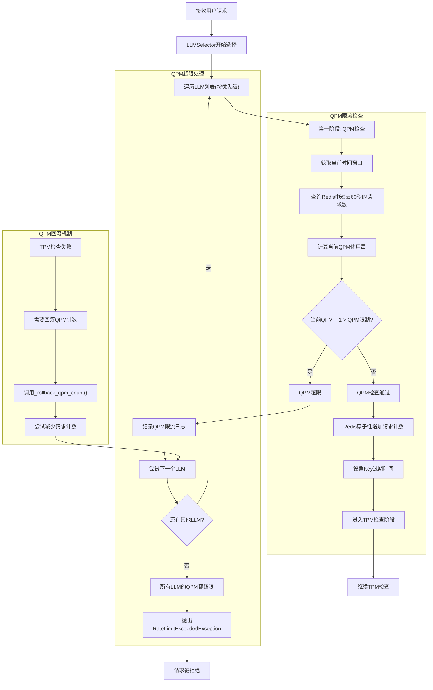
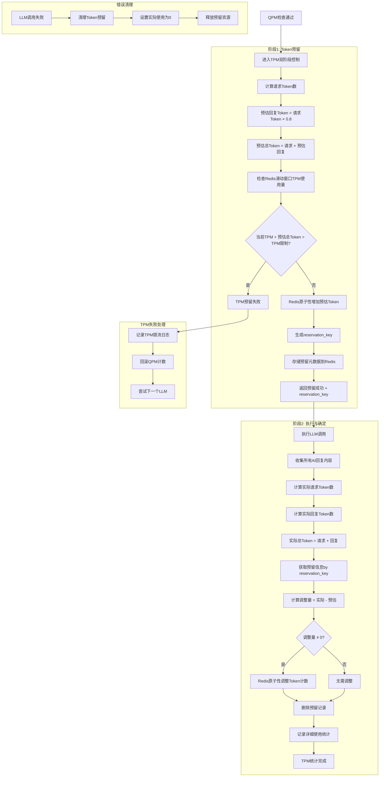
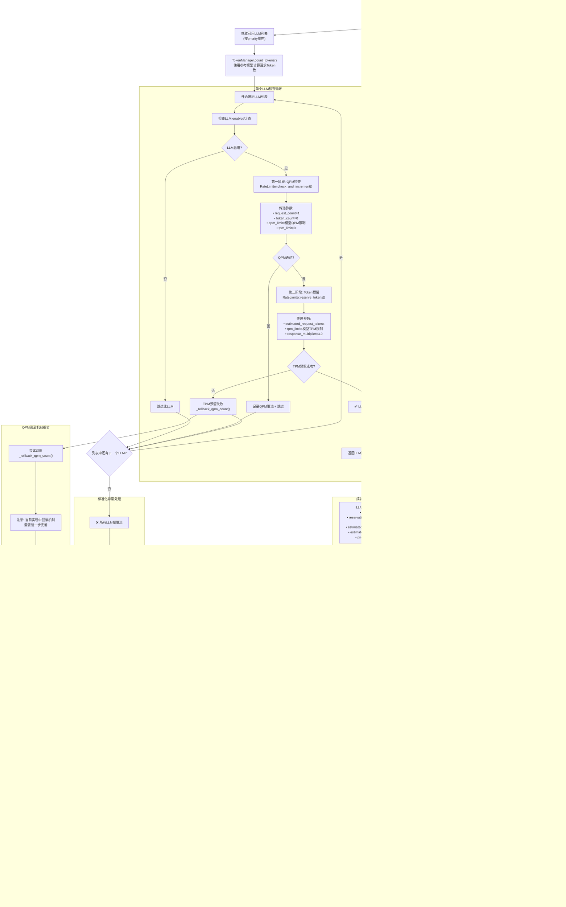
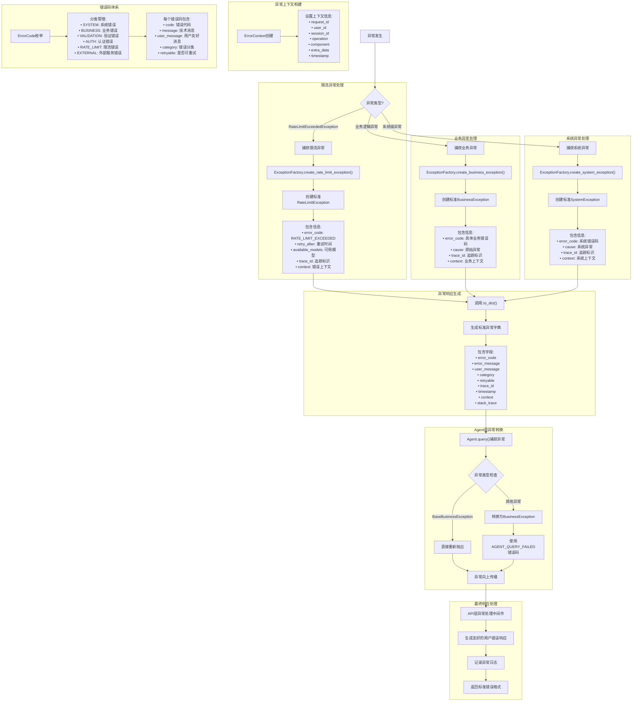
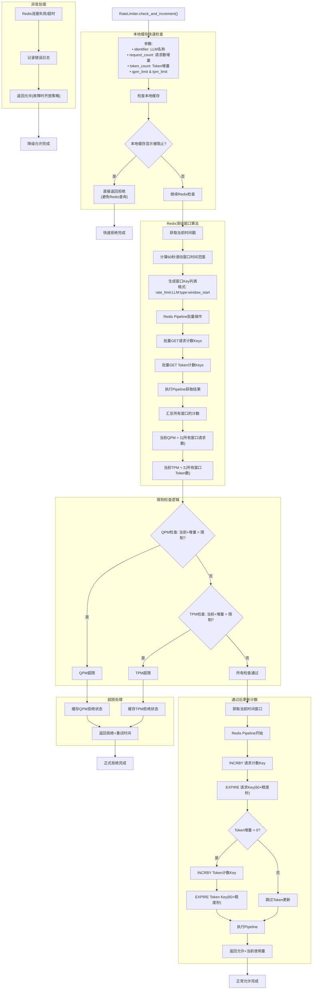
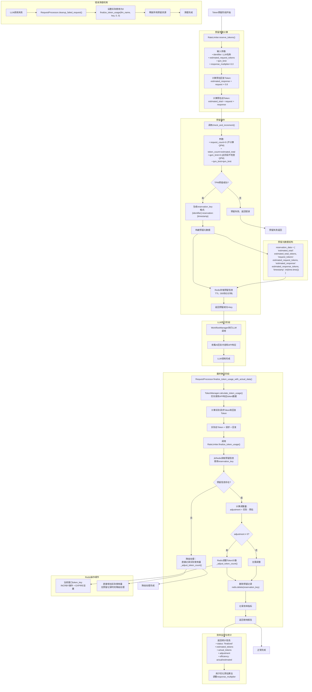
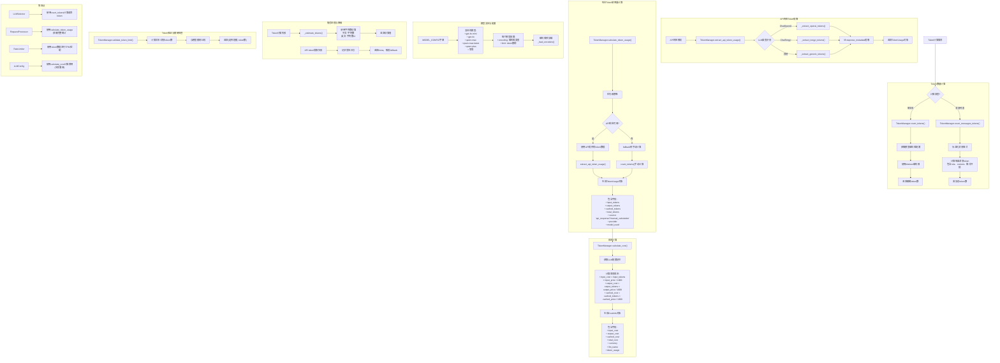
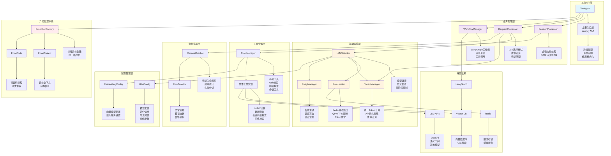

## QPM控制流程

```mermaid
graph TD
    A["接收用户请求"] --> B["LLMSelector开始选择"]
    B --> C["遍历LLM列表(按优先级)"]
    C --> D["第一阶段: QPM检查"]
    
    subgraph "QPM限流检查"
        D --> E["获取当前时间窗口"]
        E --> F["查询Redis中过去60秒的请求数"]
        F --> G["计算当前QPM使用量"]
        G --> H{当前QPM + 1 > QPM限制?}
        H -->|是| I["QPM超限"]
        H -->|否| J["QPM检查通过"]
        J --> K["Redis原子性增加请求计数"]
        K --> L["设置Key过期时间"]
        L --> M["进入TPM检查阶段"]
    end
    
    subgraph "QPM超限处理"
        I --> N["记录QPM限流日志"]
        N --> O["尝试下一个LLM"]
        O --> P{还有其他LLM?}
        P -->|是| C
        P -->|否| Q["所有LLM的QPM都超限"]
        Q --> R["抛出RateLimitExceededException"]
    end
    
    subgraph "QPM回滚机制"
        S["TPM检查失败"] --> T["需要回滚QPM计数"]
        T --> U["调用_rollback_qpm_count()"]
        U --> V["尝试减少请求计数"]
        V --> O
    end
    
    M --> W["继续TPM检查"]
    R --> X["请求被拒绝"]
```

## TPM控制流程

```mermaid
graph TD
    A["QPM检查通过"] --> B["进入TPM双阶段控制"]
    
    subgraph "阶段1: Token预留"
        B --> C["计算请求Token数"]
        C --> D["预估回复Token = 请求Token × 0.8"]
        D --> E["预估总Token = 请求 + 预估回复"]
        E --> F["检查Redis滑动窗口TPM使用量"]
        F --> G{当前TPM + 预估总Token > TPM限制?}
        G -->|是| H["TPM预留失败"]
        G -->|否| I["Redis原子性增加预估Token"]
        I --> J["生成reservation_key"]
        J --> K["存储预留元数据到Redis"]
        K --> L["返回预留成功 + reservation_key"]
    end
    
    subgraph "阶段2: 执行与确定"
        L --> M["执行LLM调用"]
        M --> N["收集所有AI回复内容"]
        N --> O["计算实际请求Token数"]
        O --> P["计算实际回复Token数"]
        P --> Q["实际总Token = 请求 + 回复"]
        Q --> R["获取预留信息by reservation_key"]
        R --> S["计算调整量 = 实际 - 预估"]
        S --> T{调整量 ≠ 0?}
        T -->|是| U["Redis原子性调整Token计数"]
        T -->|否| V["无需调整"]
        U --> W["删除预留记录"]
        V --> W
        W --> X["记录详细使用统计"]
        X --> Y["TPM统计完成"]
    end
    
    subgraph "TPM失败处理"
        H --> Z["记录TPM限流日志"]
        Z --> AA["回滚QPM计数"]
        AA --> BB["尝试下一个LLM"]
    end
    
    subgraph "错误清理"
        CC["LLM调用失败"] --> DD["清理Token预留"]
        DD --> EE["设置实际使用为0"]
        EE --> FF["释放预留资源"]
    end
```

## LLM选择与降级策略流程 (更新版)

```mermaid
graph TD
    A["LLMSelector.select_best_llm()"] --> B["获取可用LLM列表<br/>(按priority排序)"]
    B --> C["TokenManager.count_tokens()<br/>使用参考模型计算请求Token数"]
    C --> D["开始遍历LLM列表"]
    
    subgraph "单个LLM检查循环"
        D --> E["检查LLM.enabled状态"]
        E --> F{LLM启用?}
        F -->|否| G["跳过此LLM"]
        F -->|是| H["第一阶段: QPM检查<br/>RateLimiter.check_and_increment()"]
        H --> I["传递参数:<br/>• request_count=1<br/>• token_count=0<br/>• qpm_limit=模型QPM限制<br/>• tpm_limit=0"]
        I --> J{QPM通过?}
        J -->|否| K["记录QPM限流 + 跳过"]
        J -->|是| L["第二阶段: Token预留<br/>RateLimiter.reserve_tokens()"]
        L --> M["传递参数:<br/>• estimated_request_tokens<br/>• tpm_limit=模型TPM限制<br/>• response_multiplier=3.0"]
        M --> N{TPM预留成功?}
        N -->|否| O["TPM预留失败<br/>_rollback_qpm_count()"]
        N -->|是| P["✅ LLM选择成功"]
        P --> Q["返回LLM配置 + 预留信息"]
    end
    
    G --> R{列表中还有下一个LLM?}
    K --> R
    O --> R
    R -->|是| D
    R -->|否| S["❌ 所有LLM都限流"]
    
    subgraph "标准化异常处理"
        S --> T["收集限流详情"]
        T --> U["记录所有模型限流状态"]
        U --> V["抛出RateLimitExceededException<br/>(向后兼容异常)"]
        V --> W["异常包含:<br/>• message: 友好错误信息<br/>• available_models: 模型列表<br/>• retry_after: 建议重试时间"]
    end
    
    subgraph "成功路径详情"
        Q --> X["LLM配置包含:<br/>• llm实例<br/>• reservation_key: Redis预留标识<br/>• estimated_request_tokens<br/>• estimated_total_tokens<br/>• priority等配置"]
        X --> Y["继续执行LLM调用"]
    end
    
    subgraph "异常传播与处理"
        W --> Z["异常向上传播到RequestProcessor"]
        Z --> AA["RequestTracker.increment_retry()<br/>记录重试次数"]
        AA --> BB["RateLimitRetryManager处理<br/>应用退避算法"]
        BB --> CC{是否达到最大重试次数?}
        CC -->|否| DD["等待退避时间后重试"]
        CC -->|是| EE["Agent捕获异常"]
        EE --> FF["ExceptionFactory.create_rate_limit_exception()<br/>转换为标准异常格式"]
        FF --> GG["返回标准化错误响应"]
        DD --> A
    end
    
    subgraph "QPM回滚机制细节"
        O --> HH["尝试调用_rollback_qpm_count()"]
        HH --> II["注意: 当前实现中回滚机制<br/>需要进一步完善"]
        II --> JJ["建议: 实现专门的QPM减法操作"]
    end
```

## 标准化异常处理流程 (新增)

```mermaid
graph TD
    A["异常发生"] --> B{异常类型?}
    
    subgraph "限流异常处理"
        B -->|RateLimitExceededException| C["捕获限流异常"]
        C --> D["ExceptionFactory.create_rate_limit_exception()"]
        D --> E["创建标准RateLimitException"]
        E --> F["包含信息:<br/>• error_code: RATE_LIMIT_EXCEEDED<br/>• retry_after: 重试时间<br/>• available_models: 可用模型<br/>• trace_id: 追踪标识<br/>• context: 错误上下文"]
    end
    
    subgraph "业务异常处理"
        B -->|业务逻辑异常| G["捕获业务异常"]
        G --> H["ExceptionFactory.create_business_exception()"]
        H --> I["创建标准BusinessException"]
        I --> J["包含信息:<br/>• error_code: 具体业务错误码<br/>• cause: 原始异常<br/>• trace_id: 追踪标识<br/>• context: 业务上下文"]
    end
    
    subgraph "系统异常处理"
        B -->|系统级异常| K["捕获系统异常"]
        K --> L["ExceptionFactory.create_system_exception()"]
        L --> M["创建标准SystemException"]
        M --> N["包含信息:<br/>• error_code: 系统错误码<br/>• cause: 系统异常<br/>• trace_id: 追踪标识<br/>• context: 系统上下文"]
    end
    
    subgraph "异常上下文构建"
        O["ErrorContext创建"] --> P["设置上下文信息:<br/>• request_id<br/>• user_id<br/>• session_id<br/>• operation<br/>• component<br/>• extra_data<br/>• timestamp"]
    end
    
    subgraph "异常响应生成"
        F --> Q["调用.to_dict()"]
        J --> Q
        N --> Q
        Q --> R["生成标准异常字典"]
        R --> S["包含字段:<br/>• error_code<br/>• error_message<br/>• user_message<br/>• category<br/>• retryable<br/>• trace_id<br/>• timestamp<br/>• context<br/>• stack_trace"]
    end
    
    subgraph "Agent层异常转换"
        S --> T["Agent.query()捕获异常"]
        T --> U{异常类型检查}
        U -->|BaseBusinessException| V["直接重新抛出"]
        U -->|其他异常| W["转换为BusinessException"]
        W --> X["使用AGENT_QUERY_FAILED错误码"]
        V --> Y["异常向上传播"]
        X --> Y
    end
    
    subgraph "最终响应处理"
        Y --> Z["API层异常处理中间件"]
        Z --> AA["生成友好的用户错误响应"]
        AA --> BB["记录异常日志"]
        BB --> CC["返回标准错误格式"]
    end
    
    subgraph "错误码体系"
        DD["ErrorCode枚举"] --> EE["分类管理:<br/>• SYSTEM: 系统错误<br/>• BUSINESS: 业务错误<br/>• VALIDATION: 验证错误<br/>• AUTH: 认证错误<br/>• RATE_LIMIT: 限流错误<br/>• EXTERNAL: 外部服务错误"]
        EE --> FF["每个错误码包含:<br/>• code: 错误代码<br/>• message: 技术消息<br/>• user_message: 用户友好消息<br/>• category: 错误分类<br/>• retryable: 是否可重试"]
    end
```

## 分布式限流算法流程

```mermaid
graph TD
    A["RateLimiter.check_and_increment()"] --> B["参数:<br/>• identifier: LLM名称<br/>• request_count: 请求数增量<br/>• token_count: Token增量<br/>• qpm_limit & tpm_limit"]
    
    subgraph "本地缓存快速检查"
        B --> C["检查本地缓存"]
        C --> D{本地缓存显示被阻止?}
        D -->|是| E["直接返回拒绝<br/>(避免Redis查询)"]
        D -->|否| F["继续Redis检查"]
    end
    
    subgraph "Redis滑动窗口算法"
        F --> G["获取当前时间戳"]
        G --> H["计算60秒滑动窗口时间范围"]
        H --> I["生成窗口Key列表<br/>格式: rate_limit:LLM:type:window_start"]
        I --> J["Redis Pipeline批量操作"]
        J --> K["批量GET请求计数Keys"]
        K --> L["批量GET Token计数Keys"]
        L --> M["执行Pipeline获取结果"]
        M --> N["汇总所有窗口的计数"]
        N --> O["当前QPM = Σ(所有窗口请求数)"]
        O --> P["当前TPM = Σ(所有窗口Token数)"]
    end
    
    subgraph "限制检查逻辑"
        P --> Q{QPM检查: 当前+增量 > 限制?}
        Q -->|是| R["QPM超限"]
        Q -->|否| S{TPM检查: 当前+增量 > 限制?}
        S -->|是| T["TPM超限"]
        S -->|否| U["所有检查通过"]
    end
    
    subgraph "超限处理"
        R --> V["缓存QPM拒绝状态"]
        T --> W["缓存TPM拒绝状态"]
        V --> X["返回拒绝+重试时间"]
        W --> X
    end
    
    subgraph "通过后更新计数"
        U --> Y["获取当前时间窗口"]
        Y --> Z["Redis Pipeline开始"]
        Z --> AA["INCRBY 请求计数Key"]
        AA --> BB["EXPIRE 请求Key(60+精度秒)"]
        BB --> CC{Token增量 > 0?}
        CC -->|是| DD["INCRBY Token计数Key"]
        CC -->|否| EE["跳过Token更新"]
        DD --> FF["EXPIRE Token Key(60+精度秒)"]
        EE --> GG["执行Pipeline"]
        FF --> GG
        GG --> HH["返回允许+当前使用量"]
    end
    
    subgraph "异常处理"
        II["Redis连接失败/超时"] --> JJ["记录错误日志"]
        JJ --> KK["返回允许(故障时开放策略)"]
    end
    
    E --> LL["快速拒绝完成"]
    X --> MM["正式拒绝完成"]
    HH --> NN["正常允许完成"]
    KK --> OO["降级允许完成"]
```

## Token预留策略 (更新版)

```mermaid
graph TD
    A["Token预留阶段开始"] --> B["RateLimiter.reserve_tokens()"]
    
    subgraph "预留参数计算"
        B --> C["输入参数:<br/>• identifier: LLM名称<br/>• estimated_request_tokens<br/>• tpm_limit<br/>• response_multiplier=3.0"]
        C --> D["计算预估回复Token:<br/>estimated_response = request × 0.8"]
        D --> E["计算预估总Token:<br/>estimated_total = request + response"]
    end
    
    subgraph "预留操作"
        E --> F["调用check_and_increment()"]
        F --> G["参数:<br/>• request_count=0 (不计算QPM)<br/>• token_count=estimated_total<br/>• qpm_limit=0 (此阶段不检查QPM)<br/>• tpm_limit=tpm_limit"]
        G --> H{TPM预留成功?}
        H -->|否| I["预留失败，返回错误"]
        H -->|是| J["生成reservation_key<br/>格式: {identifier}:reservation:{timestamp}"]
        J --> K["构建预留元数据"]
        K --> L["Redis存储预留信息<br/>TTL: 300秒(5分钟)"]
        L --> M["返回预留成功+key"]
    end
    
    subgraph "预留元数据结构"
        K --> K1["reservation_data = {<br/>  'estimated_total': estimated_total_tokens,<br/>  'request_tokens': estimated_request_tokens,<br/>  'estimated_response': estimated_response_tokens,<br/>  'timestamp': int(time.time())<br/>}"]
        K1 --> L
    end
    
    subgraph "LLM执行阶段"
        M --> N["WorkflowManager执行LLM调用"]
        N --> O["收集AI回复内容和API响应"]
        O --> P["LLM调用完成"]
    end
    
    subgraph "最终确定阶段"
        P --> Q["RequestProcessor.finalize_token_usage_with_actual_data()"]
        Q --> R["TokenManager.calculate_token_usage()<br/>优先使用API响应token数据"]
        R --> S["计算实际请求Token和回复Token"]
        S --> T["实际总Token = 请求 + 回复"]
        T --> U["调用RateLimiter.finalize_token_usage()"]
        U --> V["从Redis获取预留信息<br/>使用reservation_key"]
        V --> W{预留信息存在?}
        W -->|否| X["降级处理：<br/>直接记录实际使用量<br/>_adjust_token_count()"]
        W -->|是| Y["计算调整量:<br/>adjustment = 实际 - 预估"]
        Y --> Z{adjustment ≠ 0?}
        Z -->|是| AA["Redis调整Token计数<br/>_adjust_token_count()"]
        Z -->|否| BB["无需调整"]
        AA --> CC["删除预留记录<br/>redis.delete(reservation_key)"]
        BB --> CC
        CC --> DD["记录效率指标"]
        DD --> EE["返回使用报告"]
    end
    
    subgraph "错误清理机制"
        FF["LLM调用失败"] --> GG["RequestProcessor.cleanup_failed_request()"]
        GG --> HH["设置实际使用为0<br/>finalize_token_usage(llm_name, key, 0, 0)"]
        HH --> II["释放所有预留资源"]
        II --> JJ["清理完成"]
    end
    
    subgraph "效率监控与统计"
        EE --> KK["返回统计信息:<br/>• status: 'finalized'<br/>• estimated_tokens<br/>• actual_tokens<br/>• adjustment<br/>• efficiency: actual/estimated"]
        KK --> LL["用于优化预估算法<br/>调整response_multiplier"]
    end
    
    subgraph "Redis操作细节"
        AA --> MM["当前窗口token_key<br/>INCRBY操作 + EXPIRE设置"]
        X --> NN["直接增加实际使用量<br/>无预留记录时的降级处理"]
    end
    
    I --> OO["预留失败返回"]
    X --> PP["降级处理完成"]
    EE --> QQ["正常完成"]
```

## 总体流程 (更新版)

```mermaid
graph TD
    A["🔥 用户发起请求"] --> B["📊 TaxAgent.query()"]
    B --> C["🆔 开始请求追踪<br/>RequestTracker.start_request()"]
    C --> D["📁 会话文件处理<br/>SessionProcessor.process_session_files()"]
    
    subgraph "会话文件处理模块"
        D --> D1{有会话文件?}
        D1 -->|是| D2{启用RAG?}
        D2 -->|是| D3["ToolsManager.create_session_vector_tool()<br/>创建会话向量搜索工具"]
        D2 -->|否| D4["读取文件内容<br/>create_non_rag_question()"]
        D1 -->|否| D5["使用原始问题"]
        D3 --> D6["create_enhanced_question()"]
        D4 --> E
        D5 --> E
        D6 --> E
    end
    
    E["🛠️ 获取工具列表<br/>ToolsManager.get_tools()"] --> F["🔄 LLM选择与重试<br/>RequestProcessor.select_llm_with_retry_mechanism()"]
    
    subgraph "专业化LLM选择与重试"
        F --> F1["RateLimitRetryManager"]
        F1 --> F2["应用专门的重试配置<br/>max_retries=5, base_delay=5s"]
        F2 --> F3["LLMSelector.select_best_llm()"]
        F3 --> F4["遍历优先级LLM列表"]
        F4 --> F5["第一阶段: QPM检查<br/>RateLimiter.check_and_increment()"]
        F5 --> F6{QPM通过?}
        F6 -->|否| F7["跳过此LLM"]
        F6 -->|是| F8["第二阶段: Token预留<br/>RateLimiter.reserve_tokens()"]
        F8 --> F9{TPM预留成功?}
        F9 -->|否| F10["回滚QPM计数<br/>_rollback_qpm_count()"]
        F9 -->|是| F11["✅ 选择成功<br/>返回LLM配置+预留信息"]
        F7 --> F12{还有其他LLM?}
        F10 --> F12
        F12 -->|是| F4
        F12 -->|否| F13["🚫 全部限流"]
        F13 --> F14["抛出RateLimitExceededException"]
        F14 --> F15["RequestTracker.increment_retry()"]
        F15 --> F16["退避算法等待<br/>(带抖动的指数退避)"]
        F16 --> F1
        F11 --> G
    end
    
    G["📈 更新请求追踪<br/>RequestTracker.update_model_selection()"] --> H["🏗️ 创建工作流<br/>WorkflowManager.create_graph_with_summary()"]
    
    subgraph "工作流创建模块"
        H --> H1["读取LLM配置阈值"]
        H1 --> H2["max_context_tokens<br/>summary_trigger_tokens<br/>max_summary_tokens"]
        H2 --> H3["创建SummarizationNode"]
        H3 --> H4{总结节点创建成功?}
        H4 -->|是| H5["正常工作流:<br/>START→summarize→call_model→tools"]
        H4 -->|否| H6["简化工作流:<br/>直通模式或降级处理"]
        H5 --> I
        H6 --> I
    end
    
    I["⚡ 执行工作流<br/>WorkflowManager.execute_workflow_with_tracking()"] --> J["准备初始状态<br/>包含SystemMessage"]
    
    subgraph "工作流执行模块"
        J --> J1["工作流流式处理"]
        J1 --> J2["summarize节点<br/>检查是否需要消息总结"]
        J2 --> J3["call_model节点<br/>动态绑定工具调用LLM"]
        J3 --> J4{LLM响应包含工具调用?}
        J4 -->|是| J5["tools节点<br/>执行工具函数"]
        J5 --> J6["收集工具结果"]
        J6 --> J3
        J4 -->|否| J7["收集AI最终回复"]
    end
    
    J7 --> K["💰 成本计算<br/>RequestProcessor.calculate_costs()"]
    
    subgraph "统一Token管理与成本计算"
        K --> K1["TokenManager.calculate_token_usage()<br/>优先使用API响应token数据"]
        K1 --> K2["TokenManager.calculate_cost()<br/>根据LLM配置计算成本"]
        K2 --> K3["RequestTracker.update_token_usage()<br/>更新请求追踪token信息"]
        K3 --> K4["RequestProcessor.finalize_token_usage_with_actual_data()<br/>完成TPM最终统计"]
        K4 --> K5["RateLimiter.finalize_token_usage()<br/>调整实际vs预估token差异"]
        K5 --> K6["清理token预留记录"]
    end
    
    K6 --> L["📊 更新请求追踪成本<br/>RequestTracker.update_cost()"] --> M["✅ 完成请求追踪<br/>RequestTracker.complete_request()"] --> N["📤 返回统一格式结果"]
    
    subgraph "结果格式 (新增字段)"
        N --> N1["result: AI回复内容"]
        N1 --> N2["request_id: 追踪标识"]
        N2 --> N3["model_used: 使用的模型"]
        N3 --> N4["provider: 模型提供商"]
        N4 --> N5["total_cost: 总成本"]
        N5 --> N6["currency: 货币类型"]
        N6 --> N7["token_usage: {<br/>  input_tokens,<br/>  output_tokens,<br/>  cached_tokens,<br/>  total_tokens,<br/>  token_source<br/>}"]
        N7 --> N8["cost_breakdown: {<br/>  input_cost,<br/>  output_cost,<br/>  cached_cost,<br/>  total_cost<br/>}"]
    end
    
    subgraph "标准化异常处理"
        O1["🚫 RateLimitException"] --> O2["ExceptionFactory.create_rate_limit_exception()"]
        O2 --> O3["转换为标准异常格式<br/>包含trace_id和context"]
        O3 --> O4["返回限流错误"]
        O5["❌ 其他异常"] --> O6["ExceptionFactory.create_business_exception()"]
        O6 --> O7["统一异常格式<br/>错误码+上下文+追踪"]
        O7 --> O8["返回业务错误"]
    end
    
    subgraph "监控与统计模块"
        P1["📈 RequestTracker"] --> P2["请求生命周期追踪<br/>成本统计<br/>失败分析<br/>重试次数监控"]
        P3["🔄 RateLimitRetryManager"] --> P4["专门的限流重试策略<br/>指数退避+抖动<br/>重试统计"]
        P5["⚡ RateLimiter"] --> P6["Redis滑动窗口限流<br/>双阶段TPM控制<br/>本地缓存加速"]
        P7["💰 TokenManager"] --> P8["统一token计算<br/>API响应优先<br/>多模型支持<br/>成本计算"]
    end
    
    subgraph "模块化管理器"
        Q1["⚙️ LLMConfig"] --> Q2["模型配置集中管理<br/>定价信息<br/>限流阈值<br/>总结参数"]
        Q3["🛠️ ToolsManager"] --> Q4["工具动态加载<br/>会话向量搜索<br/>网络搜索<br/>基础工具"]
        Q5["🔄 WorkflowManager"] --> Q6["LangGraph工作流<br/>消息总结<br/>工具调用<br/>异常处理"]
        Q7["📝 SessionProcessor"] --> Q8["会话文件处理<br/>RAG vs 非RAG<br/>问题增强"]
        Q9["🎯 RequestProcessor"] --> Q10["LLM选择重试<br/>成本计算<br/>请求清理"]
    end
```

## 统一Token管理流程 (新增)

```mermaid
graph TD
    A["Token计算需求"] --> B{计算类型?}
    
    subgraph "Token数量计算"
        B -->|单文本| C["TokenManager.count_tokens()"]
        C --> D["获取模型编码器配置"]
        D --> E["使用tiktoken编码器"]
        E --> F["返回精确token数"]
        
        B -->|消息列表| G["TokenManager.count_messages_tokens()"]
        G --> H["标准化消息格式"]
        H --> I["计算每条消息token<br/>包含role、content、格式开销"]
        I --> J["累加总token数"]
    end
    
    subgraph "API响应Token提取"
        K["API响应解析"] --> L["TokenManager.extract_api_token_usage()"]
        L --> M{LLM类型识别}
        M -->|ChatOpenAI| N["_extract_openai_tokens()"]
        M -->|ChatTongyi| O["_extract_tongyi_tokens()"]
        M -->|其他| P["_extract_generic_tokens()"]
        N --> Q["从response_metadata提取"]
        O --> Q
        P --> Q
        Q --> R["返回TokenUsage对象"]
    end
    
    subgraph "综合Token使用量计算"
        S["TokenManager.calculate_token_usage()"] --> T["优先级策略"]
        T --> U{API响应可用?}
        U -->|是| V["使用API提供的token数据"]
        U -->|否| W["fallback到手动计算"]
        V --> X["extract_api_token_usage()"]
        W --> Y["count_tokens()手动计算"]
        X --> Z["生成TokenUsage对象"]
        Y --> Z
        Z --> AA["包含字段:<br/>• input_tokens<br/>• output_tokens<br/>• cached_tokens<br/>• total_tokens<br/>• source: 'api_response'/'manual_calculation'<br/>• provider<br/>• model_used"]
    end
    
    subgraph "成本计算"
        AA --> BB["TokenManager.calculate_cost()"]
        BB --> CC["获取LLM配置定价"]
        CC --> DD["计算各项成本:<br/>• input_cost = input_tokens × input_price / 1000<br/>• output_cost = output_tokens × output_price / 1000<br/>• cached_cost = cached_tokens × cached_price / 1000"]
        DD --> EE["生成CostInfo对象"]
        EE --> FF["包含字段:<br/>• input_cost<br/>• output_cost<br/>• cached_cost<br/>• total_cost<br/>• currency<br/>• llm_name<br/>• token_usage"]
    end
    
    subgraph "模型支持与配置"
        GG["MODEL_CONFIG字典"] --> HH["支持的模型:<br/>• gpt-4o-mini<br/>• gpt-4o<br/>• qwen-max<br/>• qwen-max-latest<br/>• qwen-plus<br/>• 等等"]
        HH --> II["每个模型配置:<br/>• encoding: 编码器类型<br/>• limit: token限制"]
        II --> JJ["编码器预加载<br/>_load_encoders()"]
    end
    
    subgraph "错误处理与降级"
        KK["Token计算失败"] --> LL["_estimate_tokens()"]
        LL --> MM["使用字符数估算<br/>中文: 字符数<br/>英文: 字符数/4"]
        MM --> NN["返回估算值"]
        
        OO["API token提取失败"] --> PP["记录警告日志"]
        PP --> QQ["返回None，触发fallback"]
    end
    
    subgraph "Token验证与限制检查"
        RR["TokenManager.validate_token_limit()"] --> SS["计算文本/消息token数"]
        SS --> TT["与模型限制比较"]
        TT --> UU["返回(是否超限, token数)"]
    end
    
    subgraph "集成点"
        V1["LLMSelector"] --> V2["使用count_tokens计算请求token"]
        V3["RequestProcessor"] --> V4["使用calculate_token_usage获取完整统计"]
        V5["RateLimiter"] --> V6["使用token数据进行TPM控制"]
        V7["LLMConfig"] --> V8["使用calculate_cost计算费用(向后兼容)"]
    end
```

## 模块化架构概览 (新增)

```mermaid
graph TB
    subgraph "核心API层"
        A1["TaxAgent"] --> A2["主要入口点<br/>query()方法"]
        A2 --> A3["异常处理<br/>请求追踪<br/>结果格式化"]
    end
    
    subgraph "业务处理层"
        B1["SessionProcessor"] --> B2["会话文件处理<br/>RAG vs 非RAG"]
        B3["RequestProcessor"] --> B4["LLM选择重试<br/>成本计算<br/>请求清理"]
        B5["WorkflowManager"] --> B6["LangGraph工作流<br/>消息总结<br/>工具调用"]
    end
    
    subgraph "基础设施层"
        C1["LLMSelector"] --> C2["模型选择<br/>限流检查<br/>双阶段控制"]
        C3["RateLimiter"] --> C4["Redis滑动窗口<br/>QPM/TPM限制<br/>Token预留"]
        C5["TokenManager"] --> C6["统一Token计算<br/>API优先策略<br/>成本计算"]
        C7["RetryManager"] --> C8["智能重试<br/>退避算法<br/>统计监控"]
    end
    
    subgraph "工具管理层"
        D1["ToolsManager"] --> D2["基础工具<br/>web搜索<br/>向量搜索<br/>会话工具"]
        D3["具体工具实现"] --> D4["LaTeX计算<br/>新闻查询<br/>会话向量搜索<br/>网络搜索"]
    end
    
    subgraph "配置管理层"
        E1["LLMConfig"] --> E2["模型配置<br/>定价信息<br/>限流阈值<br/>总结参数"]
        E3["EmbeddingConfig"] --> E4["向量模型配置<br/>嵌入服务设置"]
    end
    
    subgraph "监控追踪层"
        F1["RequestTracker"] --> F2["请求生命周期<br/>成本统计<br/>失败分析"]
        F3["ErrorMonitor"] --> F4["异常监控<br/>错误统计<br/>告警机制"]
    end
    
    subgraph "异常处理体系"
        G1["ExceptionFactory"] --> G2["标准异常创建<br/>统一格式化"]
        G3["ErrorContext"] --> G4["异常上下文<br/>追踪信息"]
        G5["ErrorCode"] --> G6["错误码管理<br/>分类体系"]
    end
    
    subgraph "外部依赖"
        H1["Redis"] --> H2["限流存储<br/>缓存服务"]
        H3["LangGraph"] --> H4["工作流引擎<br/>状态管理"]
        H4["Vector DB"] --> H5["向量数据库<br/>RAG搜索"]
        H6["LLM APIs"] --> H7["OpenAI<br/>通义千问<br/>其他模型"]
    end
    
    A1 --> B1
    A1 --> B3
    A1 --> B5
    
    B1 --> D1
    B3 --> C1
    B3 --> C5
    B5 --> H3
    
    C1 --> C3
    C1 --> C5
    C3 --> H1
    C1 --> C7
    
    D1 --> D3
    D3 --> H4
    D3 --> H6
    
    B3 --> F1
    A1 --> G1
    G1 --> G3
    G1 --> G5
    
    C1 --> E1
    D1 --> E3
    
    F1 --> F3
    
    style A1 fill:#e1f5fe
    style B1 fill:#f3e5f5
    style B3 fill:#f3e5f5
    style B5 fill:#f3e5f5
    style C1 fill:#fff3e0
    style C3 fill:#fff3e0
    style C5 fill:#fff3e0
    style C7 fill:#fff3e0
    style G1 fill:#ffebee
```