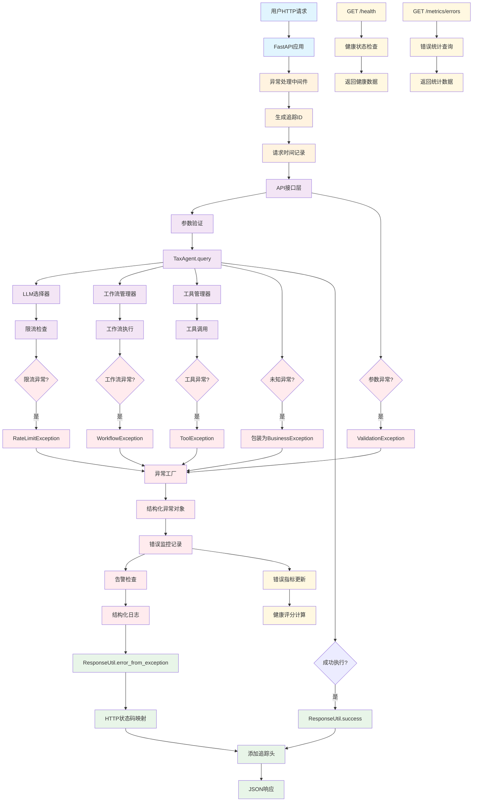
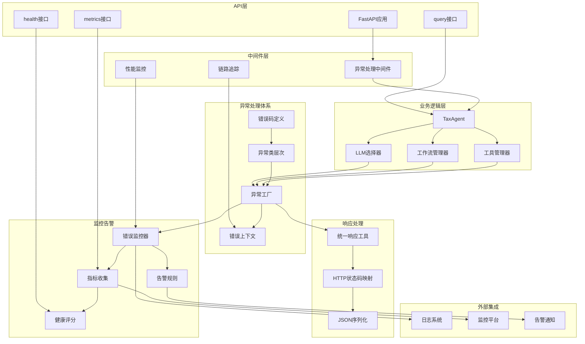
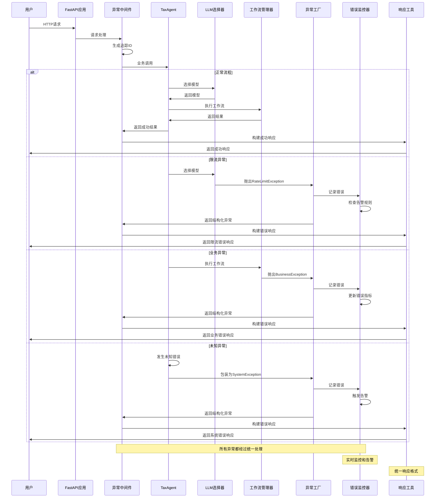

```mermaid

graph TB
    %% 请求入口层
    A[用户HTTP请求] --> B[FastAPI应用]
    
    %% 中间件层
    B --> C[异常处理中间件]
    C --> D[生成追踪ID]
    D --> E[请求时间记录]
    
    %% 业务处理层
    E --> F[API接口层]
    F --> G[参数验证]
    G --> H[TaxAgent.query]
    
    %% 核心业务逻辑
    H --> I[LLM选择器]
    H --> J[工作流管理器]
    H --> K[工具管理器]
    
    I --> L[限流检查]
    J --> M[工作流执行]
    K --> N[工具调用]
    
    %% 异常处理分支
    L --> O{限流异常?}
    M --> P{工作流异常?}
    N --> Q{工具异常?}
    F --> R{参数异常?}
    
    O -->|是| S[RateLimitException]
    P -->|是| T[WorkflowException]
    Q -->|是| U[ToolException]
    R -->|是| V[ValidationException]
    
    %% 异常转换
    S --> W[异常工厂]
    T --> W
    U --> W
    V --> W
    
    %% 通用异常处理
    H --> X{未知异常?}
    X -->|是| Y[包装为BusinessException]
    Y --> W
    
    %% 异常处理流程
    W --> Z[结构化异常对象]
    Z --> AA[错误监控记录]
    AA --> BB[告警检查]
    BB --> CC[结构化日志]
    
    %% 响应生成
    CC --> DD[ResponseUtil.error_from_exception]
    DD --> EE[HTTP状态码映射]
    EE --> FF[添加追踪头]
    FF --> GG[JSON响应]
    
    %% 成功路径
    H --> HH{成功执行?}
    HH -->|是| II[ResponseUtil.success]
    II --> FF
    
    %% 监控和健康检查
    AA --> JJ[错误指标更新]
    JJ --> KK[健康评分计算]
    
    %% 外部接口
    LL[GET /health] --> MM[健康状态检查]
    NN[GET /metrics/errors] --> OO[错误统计查询]
    MM --> PP[返回健康数据]
    OO --> QQ[返回统计数据]
    
    %% 样式设置
    classDef requestLayer fill:#e1f5fe
    classDef middlewareLayer fill:#fff3e0
    classDef businessLayer fill:#f3e5f5
    classDef exceptionLayer fill:#ffebee
    classDef responseLayer fill:#e8f5e8
    classDef monitorLayer fill:#fff8e1
    
    class A,B requestLayer
    class C,D,E middlewareLayer
    class F,G,H,I,J,K,L,M,N businessLayer
    class O,P,Q,R,S,T,U,V,W,X,Y,Z,AA,BB,CC exceptionLayer
    class DD,EE,FF,GG,II responseLayer
    class JJ,KK,LL,MM,NN,OO,PP,QQ monitorLayer

```

```mermaid
graph TB
    subgraph "API层"
        A1[FastAPI应用]
        A2[query接口]
        A3[health接口]
        A4[metrics接口]
    end
    
    subgraph "中间件层"
        B1[异常处理中间件]
        B2[链路追踪]
        B3[性能监控]
    end
    
    subgraph "业务逻辑层"
        C1[TaxAgent]
        C2[LLM选择器]
        C3[工作流管理器]
        C4[工具管理器]
    end
    
    subgraph "异常处理体系"
        D1[错误码定义]
        D2[异常类层次]
        D3[异常工厂]
        D4[错误上下文]
    end
    
    subgraph "响应处理"
        E1[统一响应工具]
        E2[HTTP状态码映射]
        E3[JSON序列化]
    end
    
    subgraph "监控告警"
        F1[错误监控器]
        F2[指标收集]
        F3[告警规则]
        F4[健康评分]
    end
    
    subgraph "外部集成"
        G1[日志系统]
        G2[监控平台]
        G3[告警通知]
    end
    
    %% 连接关系
    A1 --> B1
    A2 --> C1
    A3 --> F4
    A4 --> F2
    
    B1 --> C1
    B2 --> D4
    B3 --> F1
    
    C1 --> C2
    C1 --> C3
    C1 --> C4
    
    C2 --> D3
    C3 --> D3
    C4 --> D3
    
    D1 --> D2
    D2 --> D3
    D3 --> D4
    
    D3 --> E1
    E1 --> E2
    E2 --> E3
    
    D3 --> F1
    F1 --> F2
    F1 --> F3
    F2 --> F4
    
    F1 --> G1
    F3 --> G3
    F2 --> G2
```

```mermaid
sequenceDiagram
    participant User as 用户
    participant API as FastAPI应用
    participant MW as 异常中间件
    participant Agent as TaxAgent
    participant LLM as LLM选择器
    participant WF as 工作流管理器
    participant EF as 异常工厂
    participant EM as 错误监控器
    participant RU as 响应工具
    
    User->>API: HTTP请求
    API->>MW: 请求处理
    MW->>MW: 生成追踪ID
    MW->>Agent: 业务调用
    
    alt 正常流程
        Agent->>LLM: 选择模型
        LLM->>Agent: 返回模型
        Agent->>WF: 执行工作流
        WF->>Agent: 返回结果
        Agent->>MW: 返回成功结果
        MW->>RU: 构建成功响应
        RU->>User: 返回成功响应
    else 限流异常
        Agent->>LLM: 选择模型
        LLM->>EF: 抛出RateLimitException
        EF->>EM: 记录错误
        EM->>EM: 检查告警规则
        EF->>MW: 返回结构化异常
        MW->>RU: 构建错误响应
        RU->>User: 返回限流错误响应
    else 业务异常
        Agent->>WF: 执行工作流
        WF->>EF: 抛出BusinessException
        EF->>EM: 记录错误
        EM->>EM: 更新错误指标
        EF->>MW: 返回结构化异常
        MW->>RU: 构建错误响应
        RU->>User: 返回业务错误响应
    else 未知异常
        Agent->>Agent: 发生未知错误
        Agent->>EF: 包装为SystemException
        EF->>EM: 记录错误
        EM->>EM: 触发告警
        EF->>MW: 返回结构化异常
        MW->>RU: 构建错误响应
        RU->>User: 返回系统错误响应
    end
    
    Note over MW,EM: 所有异常都经过统一处理
    Note over EM: 实时监控和告警
    Note over RU: 统一响应格式
```
