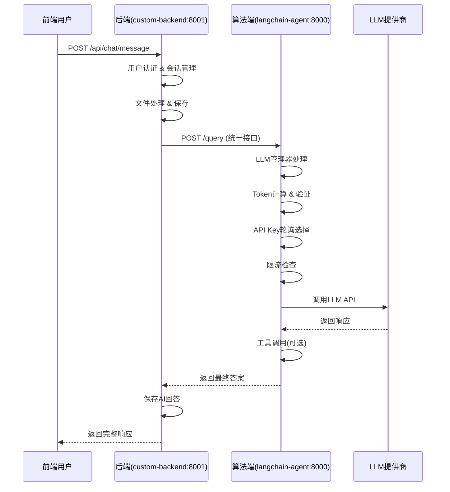

# LLM API 轮询系统架构指南

## 📐 正确的系统架构

基于您的提醒，我重新设计了架构。LLM管理功能现在正确地放置在**算法端(langchain-agent)**，而不是后端。

### 🔄 数据流架构



### 🏗️ 模块职责分离

#### 后端 (custom-backend)
- ✅ **用户认证与权限管理**
- ✅ **会话管理与数据持久化**
- ✅ **文件上传与处理**
- ✅ **业务逻辑处理**
- ✅ **调用算法端统一接口**

#### 算法端 (langchain-agent)
- ✅ **LLM API Key管理与轮询**
- ✅ **QPM/TPM限流控制**
- ✅ **Token计算与截断**
- ✅ **工具调用(向量搜索、网络搜索等)**
- ✅ **Agent逻辑处理**

## 🚀 部署配置

### 1. 算法端配置

**文件位置**: `langchain-agent/config/llm_config.yaml`

```yaml
llm_config:
  global:
    max_token_window: 100000
    request_timeout: 180
    max_retries: 3
    retry_delay: 1
    
  providers:
    qwen:
      base_url: "https://dashscope.aliyuncs.com/compatible-mode/v1"
      api_keys:
        - key: "${QWEN_API_KEY_1}"
          priority: 1
          qpm_limit: 100
          tpm_limit: 200000
          enabled: true
        - key: "${QWEN_API_KEY_2}"
          priority: 2
          qpm_limit: 100
          tpm_limit: 200000
          enabled: true
      models:
        - name: "qwen-max-latest"
          max_tokens: 8000
          temperature: 0.1
          enabled: true
        - name: "qwen-max"
          max_tokens: 6000
          temperature: 0.1
          enabled: true
          
    openai:
      base_url: "https://api.openai.com/v1"
      api_keys:
        - key: "${OPENAI_API_KEY_1}"
          priority: 1
          qpm_limit: 50
          tpm_limit: 150000
          enabled: true
        - key: "${OPENAI_API_KEY_2}"
          priority: 2
          qpm_limit: 50
          tpm_limit: 150000
          enabled: true
      models:
        - name: "gpt-4o-mini"
          max_tokens: 4000
          temperature: 0.1
          enabled: true

  model_priority:
    - provider: "qwen"
      model: "qwen-max-latest"
    - provider: "qwen"
      model: "qwen-max"
    - provider: "openai"
      model: "gpt-4o-mini"

  rate_limit:
    backend: "redis"
    key_prefix: "llm_rate_limit"
    window_size: 60
    precision: 1
```

### 2. 环境变量配置

**算法端 `.env` 文件**:
```bash
# LLM API Keys
QWEN_API_KEY_1=sk-your-qwen-key-1
QWEN_API_KEY_2=sk-your-qwen-key-2
OPENAI_API_KEY_1=sk-your-openai-key-1
OPENAI_API_KEY_2=sk-your-openai-key-2

# Redis配置(用于限流)
REDIS_URL=redis://localhost:6379/0
```

## 📦 安装与启动

### 1. 安装依赖

```bash
# 算法端
cd langchain-agent
pip install -r requirements_llm.txt

# 后端
cd custom-backend
# 后端不需要额外安装LLM相关依赖
```

### 2. 启动服务

```bash
# 启动算法端 (端口 8000)
cd langchain-agent
python api.py

# 启动后端 (端口 8001)
cd custom-backend
python server.py
```

## 🔧 API 接口

### 1. 算法端接口

#### 主要查询接口
```http
POST http://127.0.0.1:8000/query
Content-Type: application/json

{
    "text": "用户问题",
    "thread_id": "thread_123",
    "web_search": true,
    "session_files": ["/path/to/file1.pdf"],
    "enable_rag": true
}
```

#### 系统状态接口
```http
GET http://127.0.0.1:8000/status
```

### 2. 后端接口保持不变

```http
POST http://127.0.0.1:8001/api/chat/message
Authorization: Bearer YOUR_JWT_TOKEN
Content-Type: multipart/form-data

{
    "sessionId": "session_123",
    "content": "用户问题",
    "webSearch": true,
    "enableRag": true,
    "uploadedFiles": [...]
}
```

## 🎯 核心功能特性

### 1. **智能API Key轮询**
- 按优先级自动选择可用的API key
- 达到限制时自动切换到次优先级key
- 支持多个提供商(通义千问、OpenAI)

### 2. **精确限流控制**
- QPM(每分钟请求数)限制
- TPM(每分钟Token数)限制
- 基于Redis的分布式限流
- 本地缓存提升性能

### 3. **智能Token管理**
- 精确的Token计算(使用tiktoken)
- 自动消息截断(超过100k时)
- 支持多种模型的Token策略

### 4. **高可靠性设计**
- 指数退避重试机制
- 限流器故障降级策略
- API key健康检查
- 详细的监控日志

## 🔍 监控与调试

### 1. 查看系统状态

```bash
# 查看LLM系统状态
curl http://127.0.0.1:8000/status
```

### 2. 日志监控

```bash
# 算法端日志
tail -f langchain-agent/logs/*.log

# 查看限流相关日志
grep "rate_limit" langchain-agent/logs/*.log

# 查看LLM调用日志  
grep "LLM" langchain-agent/logs/*.log
```

## 🚀 性能优化建议

### 1. 生产环境配置

```yaml
# 生产环境优化配置
llm_config:
  global:
    max_token_window: 80000    # 预留20%缓冲
    request_timeout: 120       # 降低超时时间
    max_retries: 2            # 减少重试次数
    
  providers:
    qwen:
      api_keys:
        - qpm_limit: 80        # 设为官方限制的80%
          tpm_limit: 160000    # 设为官方限制的80%
```

### 2. 扩展建议

- 添加更多LLM提供商支持
- 实现智能负载均衡
- 添加成本统计功能
- 实现请求缓存机制

## ⚠️ 重要注意事项

1. **配置安全**: API key必须通过环境变量配置，不要硬编码
2. **限流设置**: 建议设置为官方限制的80%，避免触及硬限制
3. **监控告警**: 生产环境需要监控API key使用率和错误率
4. **备用策略**: 确保有多个API key作为备用

## 🔄 升级路径

如果您之前按照旧版本部署了系统，升级步骤：

1. 停止旧服务
2. 将LLM配置从后端移至算法端
3. 更新环境变量配置
4. 安装算法端的新依赖
5. 重启服务

这个新架构更符合微服务设计原则，职责分离更清晰，也更容易维护和扩展。 