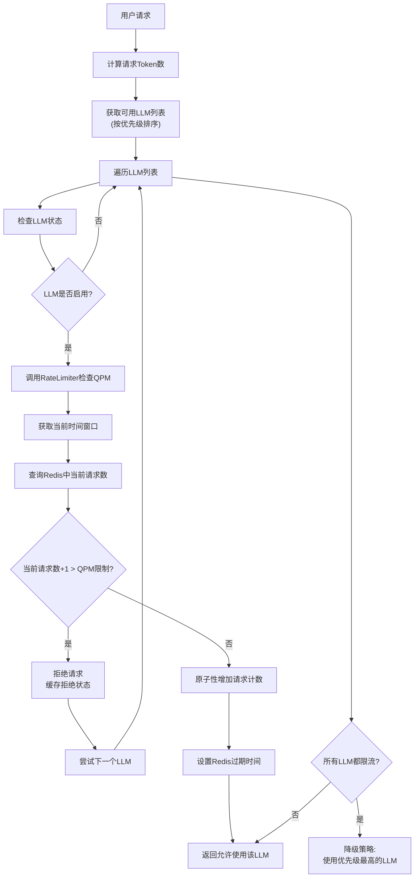
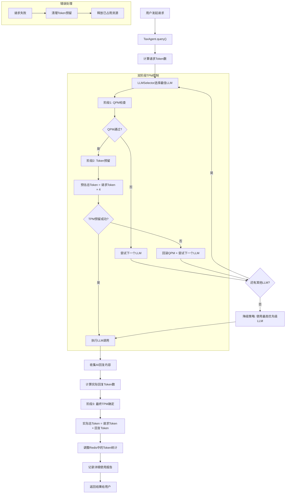
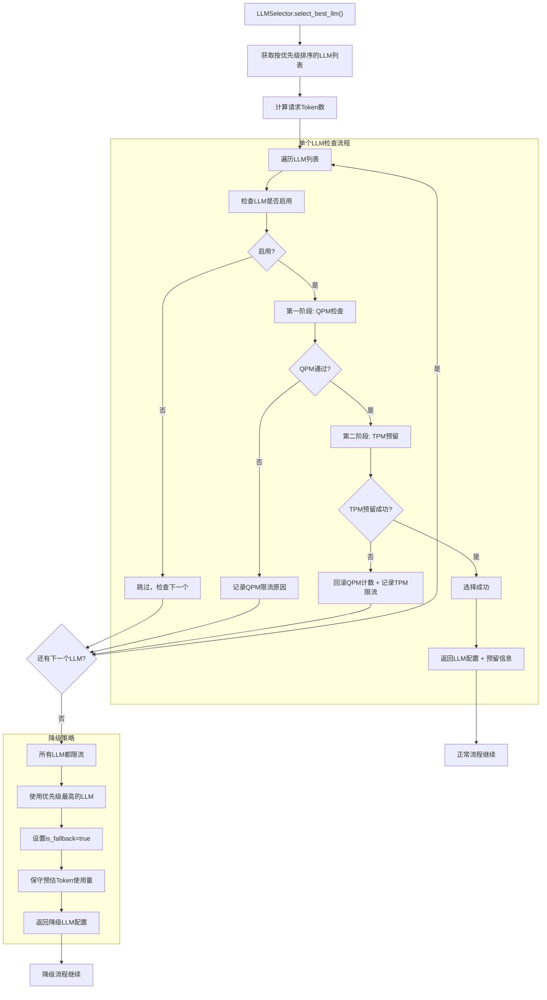

## QPM控制流程

```mermaid
graph TD
    A["用户请求"] --> B["计算请求Token数"]
    B --> C["获取可用LLM列表<br/>(按优先级排序)"]
    C --> D["遍历LLM列表"]
    D --> E["检查LLM状态"]
    E --> F{LLM是否启用?}
    F -->|否| D
    F -->|是| G["调用RateLimiter检查QPM"]
    G --> H["获取当前时间窗口"]
    H --> I["查询Redis中当前请求数"]
    I --> J{当前请求数+1 > QPM限制?}
    J -->|是| K["拒绝请求<br/>缓存拒绝状态"]
    K --> L["尝试下一个LLM"]
    L --> D
    J -->|否| M["原子性增加请求计数"]
    M --> N["设置Redis过期时间"]
    N --> O["返回允许使用该LLM"]
    D --> P{所有LLM都限流?}
    P -->|是| Q["降级策略:<br/>使用优先级最高的LLM"]
    P -->|否| O
```

## TPM控制流程

```mermaid
graph TD
    A["用户发起请求"] --> B["TaxAgent.query()"]
    B --> C["计算请求Token数"]
    C --> D["LLMSelector选择最佳LLM"]
    
    subgraph "双阶段TPM控制"
        D --> E["阶段1: QPM检查"]
        E --> F{QPM通过?}
        F -->|否| G["尝试下一个LLM"]
        F -->|是| H["阶段2: Token预留"]
        H --> I["预估总Token = 请求Token × 4"]
        I --> J{TPM预留成功?}
        J -->|否| K["回滚QPM + 尝试下一个LLM"]
        J -->|是| L["执行LLM调用"]
    end
    
    L --> M["收集AI回复内容"]
    M --> N["计算实际回复Token数"]
    N --> O["阶段3: 最终TPM确定"]
    O --> P["实际总Token = 请求Token + 回复Token"]
    P --> Q["调整Redis中的Token统计"]
    Q --> R["记录详细使用报告"]
    R --> S["返回结果给用户"]
    
    G --> T{还有其他LLM?}
    K --> T
    T -->|是| D
    T -->|否| U["降级策略: 使用最高优先级LLM"]
    U --> L
    
    subgraph "错误处理"
        V["请求失败"] --> W["清理Token预留"]
        W --> X["释放已占用资源"]
    end
```

## LLM选择与降级策略流程

```mermaid
graph TD
    A["LLMSelector.select_best_llm()"] --> B["获取按优先级排序的LLM列表"]
    B --> C["计算请求Token数"]
    C --> D["遍历LLM列表"]
    
    subgraph "单个LLM检查流程"
        D --> E["检查LLM是否启用"]
        E --> F{启用?}
        F -->|否| G["跳过，检查下一个"]
        F -->|是| H["第一阶段: QPM检查"]
        H --> I{QPM通过?}
        I -->|否| J["记录QPM限流原因"]
        I -->|是| K["第二阶段: TPM预留"]
        K --> L{TPM预留成功?}
        L -->|否| M["回滚QPM计数 + 记录TPM限流"]
        L -->|是| N["选择成功"]
        N --> O["返回LLM配置 + 预留信息"]
    end
    
    G --> P{还有下一个LLM?}
    J --> P
    M --> P
    P -->|是| D
    P -->|否| Q["所有LLM都限流"]
    
    subgraph "降级策略"
        Q --> R["使用优先级最高的LLM"]
        R --> S["设置is_fallback=true"]
        S --> T["保守预估Token使用量"]
        T --> U["返回降级LLM配置"]
    end
    
    O --> V["正常流程继续"]
    U --> W["降级流程继续"]
```

## 分布式限流算法流程

```mermaid
graph TD
    A["用户发起请求"] --> B["TaxAgent.query()"]
    B --> C["计算请求Token数"]
    C --> D["LLMSelector选择最佳LLM"]
    
    subgraph "双阶段TPM控制"
        D --> E["阶段1: QPM检查"]
        E --> F{QPM通过?}
        F -->|否| G["尝试下一个LLM"]
        F -->|是| H["阶段2: Token预留"]
        H --> I["预估总Token = 请求Token × 4"]
        I --> J{TPM预留成功?}
        J -->|否| K["回滚QPM + 尝试下一个LLM"]
        J -->|是| L["执行LLM调用"]
    end
    
    L --> M["收集AI回复内容"]
    M --> N["计算实际回复Token数"]
    N --> O["阶段3: 最终TPM确定"]
    O --> P["实际总Token = 请求Token + 回复Token"]
    P --> Q["调整Redis中的Token统计"]
    Q --> R["记录详细使用报告"]
    R --> S["返回结果给用户"]
    
    G --> T{还有其他LLM?}
    K --> T
    T -->|是| D
    T -->|否| U["降级策略: 使用最高优先级LLM"]
    U --> L
    
    subgraph "错误处理"
        V["请求失败"] --> W["清理Token预留"]
        W --> X["释放已占用资源"]
    end
```

